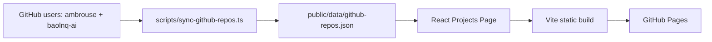

<div align="center">

# Nguyễn Lê Quốc Bảo — AI Systems Portfolio

Professional portfolio for GitHub project ownership, AI platforms, backend architecture, RAG systems and Edge AI delivery.


[Overview](#overview) · [Flow](#system-flow) · [Quick Start](#quick-start) · [Repository Map](#repository-map) · [Deployment](#deployment)

</div>

## Overview

This repository contains a full rebuild of the previous static portfolio. The old 3D scene has been replaced with a smoother, cleaner and more professional React interface using an editorial book-inspired visual system, custom SVG bookplate branding, SEO/social preview metadata, dark/light reading modes, Vietnamese/English content and build-time GitHub repository sync.

| Area | Details |
|---|---|
| Identity | Nguyễn Lê Quốc Bảo |
| Focus | AI systems, backend architecture, RAG, Edge AI, automation |
| GitHub sources | `ambrouse`, `baolnq-ai` |
| Deployment target | GitHub Pages |
| Runtime model | Static frontend, generated repository JSON |

## System Flow



## Quick Start

```bash
npm install
npm run sync:github
npm run dev
```

Production validation:

```bash
npm run lint
npm run typecheck
npm run test
npm run build
```

## Application Pipelines

| Pipeline | Command | Output |
|---|---|---|
| GitHub sync | `npm run sync:github` | `public/data/github-repos.json` |
| Content validation | `npm run validate:content` | Validates locale and project JSON |
| Local dev | `npm run dev` | Vite dev server |
| Production build | `npm run build` | `dist/` static site |
| Tests | `npm run test` | Vitest content checks |

## Deployment

GitHub Pages deployment is handled by `.github/workflows/deploy-pages.yml`.

Triggers:

- Push to `main`
- Manual `workflow_dispatch`
- Daily scheduled rebuild to refresh GitHub repository data

The workflow uses the built-in `GITHUB_TOKEN` during the build step. The token is not exposed to the browser.

## Repository Map

| Path | Purpose |
|---|---|
| `src/app` | App routes and providers |
| `src/pages` | Home and Projects pages |
| `src/components` | Layout, shared UI and motion components |
| `src/features` | Theme, i18n and GitHub project loading |
| `src/content` | Curated English/Vietnamese portfolio copy and project overrides |
| `src/styles` | Global theme tokens, layout and responsive CSS |
| `scripts` | GitHub sync and content validation scripts |
| `public/assets` | Preserved profile, project and icon assets |
| `public/data` | Generated static project index |
| `docs` | Technical notes and phase reports |
| `logs` | Task execution logs |

## Docs Index

- [`docs/github-sync.md`](docs/github-sync.md)
- [`docs/design-system.md`](docs/design-system.md)
- [`docs/phase-completion-report.md`](docs/phase-completion-report.md)

## Notes On Accuracy

Repository cards are generated from public GitHub metadata at build time, then lightly normalized for portfolio readability. If a repository has weak or missing metadata, the portfolio uses a neutral fallback instead of inventing capabilities.
